# Kaling

## Video Version

This [video guide](https://youtu.be/i2OWw9q4NuE) was made in March 2026. It has an outdated version of these notes but still covers mostly everything in video form (because i’m updating these from time to time lol)

## Upcoming Boss Changes

Probably sometime towards END of Crown like 9/9 (our GMS summer update) or after.

[2026/03/16 Orangemushroom patch notes](https://orangemushroom.net/2026/03/16/maple-now-lan-virtual-tour/)

```bash
**Kaling**

- Pattern pre-delays have been adjusted, and you can attack Qiongqi/Kaling while they are flying.
- In Phase 2/3, when the boss is bound, the forced teleport pattern will be removed.
- In Phase 3, you can only hit the Peril in the area that you are
currently in. (Ascents will still hit all 3 Perils regardless of which
area you are in) This was done to alleviate the difference between
classes that could hit multiple Perils at the same time and those that
could not.
- In Phase 3, the monsters’ HP have been lowered.
```

[Hitbox updates](https://www.inven.co.kr/board/maple/2304/47092?category=%EB%AA%AC%EC%8A%A4%ED%84%B0 )

Whenever we get p1 bird and p2 Kaling targetable during fly, can do some crazy shit like the [F/P in this run](https://youtu.be/Ov-HczjTgO8?si=_jPKhY1Q2O1PJXvr&t=228) to keep Kaling and Bird in the same spot forever

P1 

- Bird is targetable during fly, and so is P2 Kaling - **this means bird starts becomes a lot more viable and easier to do without cd hat. **
    - If you start bird, this means you can reliably get your 60s off before test if you time the sol hecate bind. Versus the strat I was using where you pretty much waste majority of your 60s to some rng.
        - Confirmed as of 6.4.26, you can delay bird going into painting with this.
- Tiger attack delays are increased, as in there’s a lot more time before the hitbox comes out. You can also duck his dash.

P2

- Styx bind her to keep her from flying away when applicable, **don't use it to extend binds**
- Chasing Kaling down in p2 will give you a dps increase depending on where she flies. My initial thought would be still NOT to chase to top right or top left and only chase bottom

P3 

- Tiger lightning is delayed, as in hitbox comes out later.
- Cheese strat dies in exchange for HP decrease of all perils. **You HAVE to play inside the animal now or you will not do damage to the animal. This means you have to learn the bird + tiger patterns. Ascents will still damage all 3 perils.**
    - You can still boom the gauges but you can’t afk in dog and hit bird + tiger like a lot of clears do. Haven’t seen enough vods of what to do after this change in terms of routing
    - [Watch this for bird and tiger patterns](https://youtu.be/wucyLIsf684?si=nJ_XkjF4HpMjcbxl&t=1718 - )
- Clutch will not spawn when Kaling is bound.

## Inven Hitboxes/Useful Links

All hitboxes will be taken from these links.

[MaplestoryWiki on Kaling](https://maplestorywiki.net/w/Kaling/Monster) -  Has some useful info about attack cds

[Maple inven post on Kaling hitboxes](https://www.inven.co.kr/board/maple/2304/45564) - Bird, Tiger, Dog, Kaling hitboxes

[Maple inven post on Kaling map pattern hitboxes](https://www.inven.co.kr/board/maple/2304/45565) - P2 tendrils and fmas, and P3 animal hitboxes

## Dawn Warrior Reference Runs

[6 burst timeout](https://www.youtube.com/watch?v=IThQQoALF6k) - If I didn’t lag so far behind on burst timings and tiger died earlier this would’ve cleared. 6 burst is a lot harder than 5 burst but it is doable. **We haven’t seen a 6 burst dw p1 clear yet.**

[ArinaTei's 109.4k destiny equivalence hard kaling clear](https://youtu.be/qSCT0Z21rBo?si=loffDwVVSbO2DBOy) - best reference we have

[109942 HEXA Hard Kaling Clear](https://youtu.be/gC2BInLJ6FQ) - Min clear bird start reference. **I am using Boss Mapae node from Ride or Die in this**

[One Hand Hard Kaling Solo](https://youtu.be/iKlBckiEWw8) - can see how important it is to know the positioning

[more kaling example destiny runs (no cd hat, 109332 with mapae, ror5, wj5)](https://youtu.be/2oafFfv47r0?si=PiF8PLZ2eNQ4Zp3p)- no cd hat tiger vs bird start example runs at a min clear spec (5 burst 1 ascent). 

## Guide Notes

**[Willoweiss Maplestory Destiny Kaling Liberation Guide](https://youtu.be/wucyLIsf684?si=A8dfNdqi6uSQ-wNf) - THIS GUIDE IS GOATED AS AN INTRO**

If you follow all the tips in my guide you can clear with 1 hand confidently like I did LMAOOOO

These are all the small things I noticed + gathered from people during my prog of this boss, and just wanted to compile them in one place to help people out. Special thanks to Dawns + Tenpai + Tei + whoever else. I will assume you already have a basic understanding of the boss outside of not playing p2 and not holding kaling in p3, because I didn’t have either of those.

This guide does not cover

- Attack cooldowns - specifically how long each is, like 12s or so or whatever
- Tiger or bird cheese - I don’t have enough experience with these strats
- Lots of p2 strats specific to classes outside of dw
- Extra external buffs
    - Marble buff
    - Yu garden buff
    - Concentration title
    - Tangyoon

**Your main goal is to always be popping burst off cd in p1, so you have some leeway to leak in p2, and then always off cd in p3.** You have about 30s of leeway before you end up losing part of your 16th burst (as in 15:30 latest), a good indicator is if you’re bursting on every even minute mark or before it.

**Do not EVER backload your genesis iframe during this boss, you are going to need it for p2 and p3.**

## How to Effectively Practice in Easy Mode

Every time you do a practice run of easy, take off your gear, and **set an intention (aka one of the goals below).**

This really only applies to p1 dog, p2, and p3. p1 tiger and bird you can learn by just doing runs. There isn’t much to say about p1 dog except for you to go in there, learn how to time his tests and delay them with the bind (explained later in this guide), and always dodge his fd reduction farts.

For p2, here are some key points:

- Kite Kaling effectively, whether that’s along the bottom you see in most of people’s runs including mine, or between the middle plats. This means you should have a good understanding of
    - ALWAYS chasing her when she’s bottom
    - **Baiting out her attacks while dpsing**
    - **How to play around puddles and kiting her back to fountain**
    - **NEVER GETTING STUNNED**
    - Not tanking random bomb ticks when necessary.
    - Her attack hitboxes

Choose one of these things to focus on until you feel good about it, and then move onto the next. 

For p3, here are some key points:

- Whatever class you play, vod review people who have cleared and ask your respective discords/whatever if there are any specific lineups or routes that people take and why they do it. For example, you **NEED** all the burst lineups for dawn warrior, knowing the double peril solar slash will help you significantly
    - I list all the lineups in this guide like cosmos lineups, burst lineups, double peril lineups, and how far you’re allowed to stand for Dawn Warrior.
- Pot cooldown and an understanding of “okay she is outside I have to play more careful”
- Up jumping everything and NEVER dodging into Tiger (assuming dog cheese strat)
- **Understand how each attack is on a cooldown, and chances are after she and dog are done being bound, every attack will come out immediately.**
    - If you learn how to desync her attacks with chains you can stay on fountain for a majority of the phase without ever having to upjump except for pushes and slams. You don’t necessarily need to know how to do this but it’s cool to know.
- **Lining up Kaling during the bursts where 1 animal is already dead. Example is the 6 minute origin burst for a dog cheese, you want Kaling in front of you otherwise you’re losing damage if your skills don’t hit behind you**
- Her attack hitboxes

## P1

First decide if you want to start in bird or tiger, I don’t really think there’s any reason to start in dog because you will always lose your 60s to test and the benefits of starting in bird (burst off cd and don’t lose willpower) or starting in tiger (no shields) outweigh anything from dog.

The way I view it is if you have a cd hat/don’t mind re-cubing for it, start tiger. If you are a lot stronger than min clear (like 110.5-112k+) and have 3line hat, start bird.

**If you’re going for 5 burst 1 ascent p1, dws save the origin from the second animal, swap to risk taker, and pop it immediately on entering the third animal. This might differ from class to class.**

### Starting Bird

Starting bird means you’re bursting off cd and have more leeway later. However, you NEED to be strong enough to kill bird during the 2nd burst and before the 2nd test. You can do fast tiger coil setup and have coils setup for every, burst and 60s mini (though this is only possible if you can get out of the first animal during the second burst or at least 20s before the 60s come back).

You can get away with starting in tiger but if you lose any time in p2 to not controlling her you will lose the 16th burst. I don’t know the exact amount but double coil setup makes up for that and definitely puts you ahead. 

### Starting Tiger

Starting tiger means no shields and theoretically have to do less damage! However, cd hat makes life a lot easier but allows you to clear at lower spec (110k) because you start bursting at around 29:36 (the earliest, most people will set it up around 29:32) vs 29:52 in bird. You need to make up that lost time by bursting off cd (but not screwing up flies/test) in the other phases.

If you start tiger p1, you swap into risk taker regardless of what class you are on entry into bird. same with bird → dog

### Bird

- Drag bird as close to center as possible to shorten flies (there’s a position to make a shorter fly to middle instead of opposite side of the map, though idk what it is). **This is especially important when you're a min clear, because every second of fly wasted is another second of damage you could've done**
- Delay test to line up with your cds (~45s cd at least for burst, you can probably do 25s cd or 5s if you’re coming from a different animal).
- Understand how to force flies and how to delay them. You can force a fly by standing out of all of his hitboxes, it has roughly a 17s cd. You can delay a fly by trying to get him to attack you right before he is supposed to fly
- **Test timer, is 1 minute from when you break test**

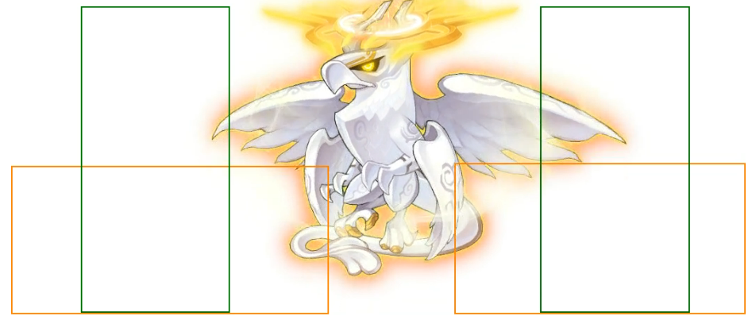

- Know hitboxes (Front slap, back slap, pillars)

If you’re starting bird and you burst immediately, before the 2x binds are over you want to stand in the hitbox of his two slap attacks + potentially his pillars so you can delay his fly. **For the homies like DW that have 30s burst, this means you can get a lot more of the burst off without him flying away immediately and thus more damage. This will likely delay before he goes into his first test as well, if you manage to get him to slap you at least twice.**

- If you have Sol Hecate: Styx on autocast with cosmos (or manually cast fast enough) and you’re bursting fast enough (as in on bird spawn/entry), you can stall the first test and styx bind before he goes into it. Which means you don’t completely lose your 60s. You can reference my 1 hand solo or bird start min clear to see this in action.

Always try to keep him as close to center as possible, it’s a lot easier to drag him and delay his fly when he’s on bottom left or bottom right.  You can drag him by standing closest to center, though I would dodge all his attacks first because he’ll try to cast all 3 off cd if you stand in the hitboxes.

I found that 45 is the sweetspot for fly cds (specifically when starting bird), but the second you break his test, force him to fly (stand OUTSIDE of his hitboxes). After that just follow him around and do damage. 5s is also a good number if you're coming from Tiger

It would be a better idea to pay attention to his test timer, it’s 1 minute from when you break test. If you get out of bird during the second burst, you can go for fast double coil setup in tiger which should more than enough make up for the tiger shields. I think this usually means you have enough damage to 5 burst 1 ascent p1. 

### Tiger

- LEARN HIS HITBOXES. TIGER IS NOT AS RNG AS MOST PEOPLE SAY IT IS, IF YOU CAN PROPERLY PLAY AROUND HIS POSITIONING AND HIS ATTACK CDS + HITBOXES

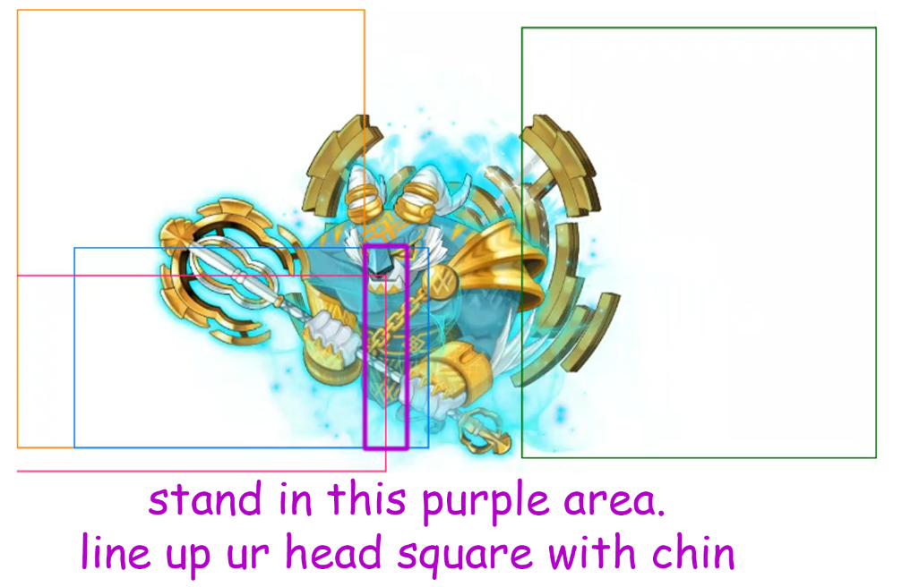

- Double coil setup - follow the pathing of arrows. Red → Pink → Sky Blue → Orange

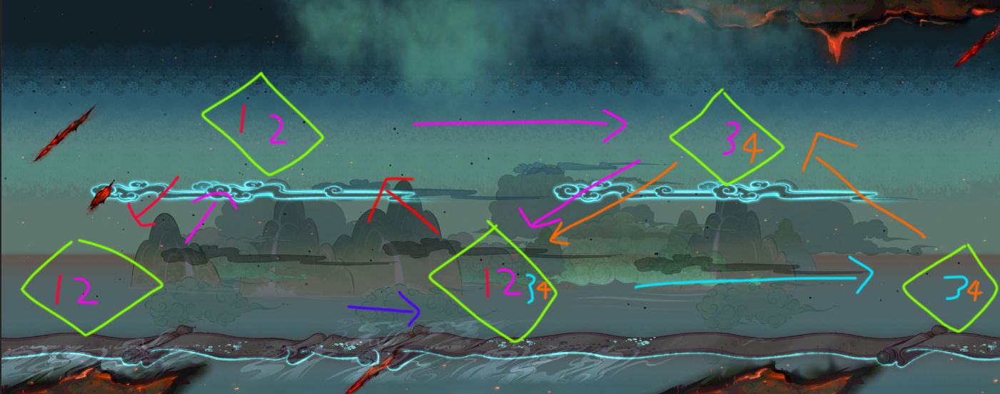

- **Each activate triangle lasts 30s.** Pay attention to this so you know when to use your 60s and how early you can activate a triangle.
- Spam fountain and don’t get hit often because you’ll lose damage trying to fix gauge
- **Spend a good amount of time in here in Hard Practice Mode to get a feel/internal cd for everything**
- If you are trying to activate the bottom middle coil, **get him to tp to the side of where the triangle ISN’T being activated, and then bait out an attack.** This is so that he doesn’t rush outside of the triangle and screw up your run

On entry you should immediately line yourself up under his chin (be SQUARE with his chin, reference the non overlapping area of the blue square), and he’ll either FMA you or rush. The second he rushes you want to get to top left coil so the tp activates the middle coil. 

I think his tp cd is roughly 12s. The second he activates top left coil, **DO NOT BAIT OUT ANY OF HIS OTHER ATTACKS.** I would just go straight to bottom left coil, or dps a little bit then go. There’s not much else to say besides knowing exactly where his hitboxes are and manipulating him to activate the coils like the picture above. Anytime you burst, try to get him to rush to the center of the triangle, but also pay attention to how long you have left before the triangle turns off. I like to go to the finishing diamond whenever I have 5s left on cds before my burst comes back up.

Try to keep him always on the coil or bait out the rush to the correct direction beforehand using chin lineup so he doesn’t fuck up his position before you’re trying to activate a coil.

**If you want him to not attack you, stand in the empty hitbox. If you want him to attack you, stand in the hitbox of the attack where you KNOW his attack is up. This entire phase is knowing his hitboxes and playing around his cds.** 

The advantage of double coil setup is that you have 60s that aren’t fd reduced. I recommend taking some time and just spamming hard p1 practice modes until you can juggle him properly.

You should be able to get out of tiger during 2nd burst without having to use origin, I wasn’t able to test this using double coil strat for 6 burst but I do think this helps to push a lot of people to 5 burst 1 ascent.

**If you know you are a lot stronger than min clear, you can also activate the coils for 2nd burst a lot earlier. This lets you chip more damage and have more carryover into your next animal, you can see this in my one handed run too.**

### Dog

Big notes

- Know his attack cds. He will try to pop everything off of cooldown and in a sequence.
- Dodge all FD farts - they reduce your fd if u get farted on
- Know his hitboxes

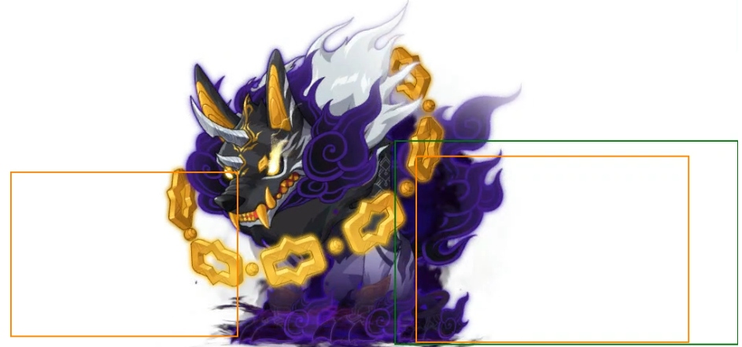

- **Know your entry time so you can time bind to delay his test and extend your dps,** or you can look at what time the first test starts and go from there

If you have the origin from previous animal, manually switch to risk taker, true sight, and origin immediately. You might have a lot of lingering burst like I did and I just like the idea of using risk taker and playing better, you could also use totaling.

**Spend some time in practice mode to learn the delay of his attacks, you still need to get a feel for the cd of them but they’re a lot more reactable now. as in there’s a visual indicator on his back swipe as well as his fart**

I chose to play very far from him and bait out his fd reduce fart because dw has massive range. The main thing is building that internal cd for his attacks and making sure you don’t get farted on during burst or minis.

Place fountain down and get a feel for when his gas attack is up too. If you are confident playing without fountain, don’t use it because it doesn’t let you server lag your buffs.

For his yellow bar rush attack, I ended up iframing most of these just to make sure I break it with no issues.

The second the first test starts, **TAKE NOTE OF THE TIMER. YOU ARE GOING TO BIND VERY LATE TO DELAY THE NEXT TEST DURING YOUR BURST. Each test is a minute from when the previous one starts.** Example: His test started at 22:40. I would bind BEFORE 21:40 to make sure he doesn’t go into test again and extend my dps/burst. Like at 21:41 or something

At some point during test you need to fix your ring swap and manually swap back to ror. This is why practicing is important, because if you learn the timing you can flash jump the test and swap no problem.

Depending on your pacing you either go for 5 burst 1 ascent, 5 burst no ascent, or 6 burst no ascent p1. 5 burst 1 ascent or 0 ascent you should get out before your 20min burst comes back up, 6 burst you should get out around 19:30-20:00. Check how much damage your ascent does so you know ahead of time of whether or not you need to use it.

## P2

Big notes

- Learn all of her hitboxes and attack cds (reference the hitbox guide). **Her blue tiger slam only has a hitbox behind her.**

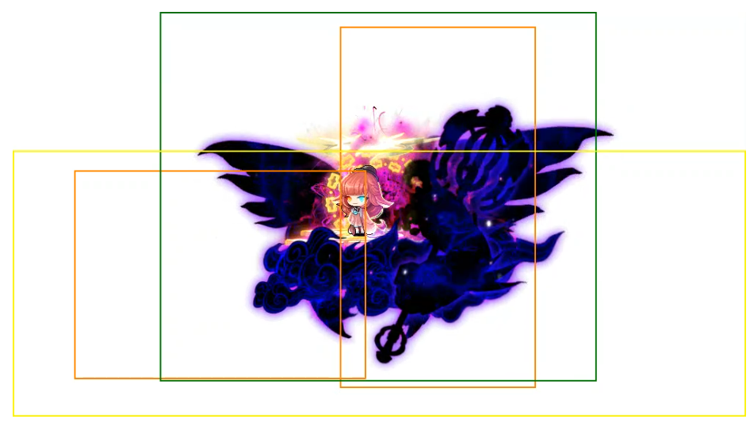

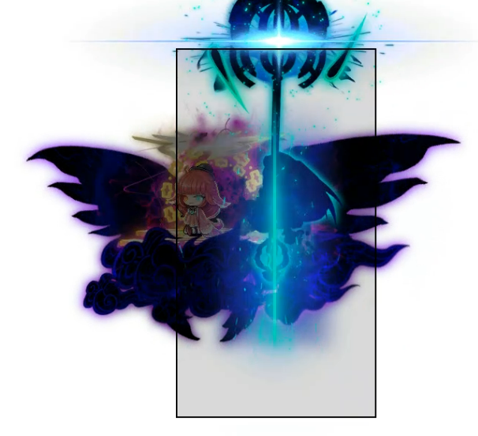

- Know the safe spot (right mid plat, leftmost part of the platform). **You can blink where the green circles are, ignore everything else I just used this picture bc I couldn’t find a good map.**

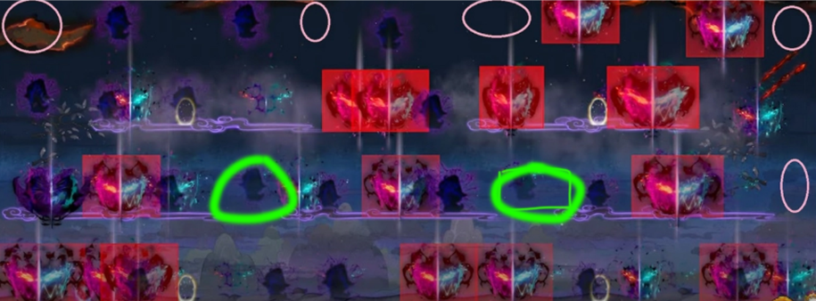

- Figure out if you can play mid plats and tp back and forth or play bottom
- Forcing fly and when to chase her
- **ABUSE FOUNTAIN**
- Manually ring swapping if needed
- **Do not ever get stunned by anything. Her bird wings, purple tendrils, tiger slam, and puddle (from 4 ticks)**

People usually end up playing mid right and mid mid plat, or under mid plat or on the tp in the bottom right plat. **For the bottom, this is usually because there are no puddles there on the tp or under mid plat.** To the left of that spike where my fountain is under mid plat is the “safe” area.

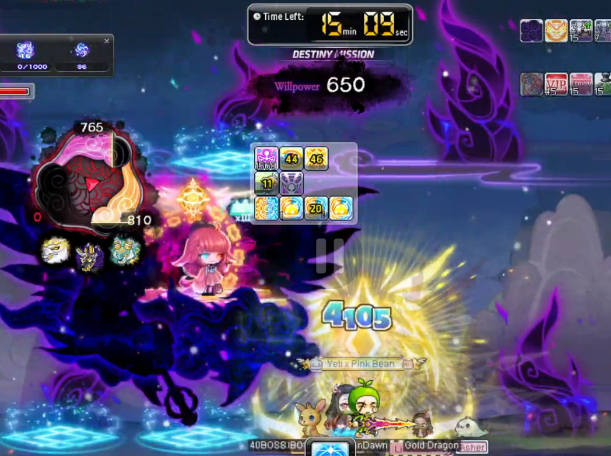

For p2 I would spend a lot of time rushing there in easy mode and timing out. Similar to baiting out bird attacks to delay fly, you can bait out all 3 of her attacks + scroll to delay fly too. **However, if you want to force her to fly, you need to bait out ALL of her attacks and play on her, otherwise she will tp around.** In my destiny clear run, I didn’t understand this and she tp’d 3 times before she flew.

If you take stand in the blue puddles for long enough (even if you’re iframed), you will get stunned immediately when you get out o pay attention to that. It’s around 4 ticks of it regardless of if you’re iframed or not, DO NOT GET STUNNED OR PREPARE TO WILL.

Get a feel for when scroll is up, roughly every 2nd fly is when the cd is done. If you’re not sure just play out of range and bait it out or have someone else time, do not greed.

Her attacks enable before test is done so you want to bind her early if that happens otherwise she can fly away.

**Now when do you decide between chasing her vs letting her fly and tp back?**

- If you’re already falling behind on bursting even minute mark, follow her and burst (you can continue waiting if you have cd hat but not too far behind, like 30s behind)
- If you have leeway, wait for her to tp back.
- If you know test timer and it’s going to happen before she flies away again, follow her and burst and bind during test. Fly cd is roughly 17s from when she uses it.
- 3.7.26 - If you’re a dw, always chase her if you know your cds are going to line up with her fly and you don’t have to wait for the tp. IMO you can afford to chase kaling to start every burst, your burst cycle is 5s sun iframe -> gene iframe -> 5s cut sun iframe -> kaling flies away, so you should never have an issue bursting anywhere on the map. - Tenpai
    - I think even if you’re not a dw, you can chase anyway so you don’t lose a couple seconds waiting for her to tp, especially if you know you’re falling behind already.

I would save dw iframe for every test and try to keep her under bottom mid so it’s shorter fly paths + incase i’m off burst or using 60s, I can use the mid right safe spot to do damage during test too. If dw iframe is up I can continue dpsing, otherwise I can just go to the test safe spot.

You should be able to get out of here during the 3rd burst. If you’re doing 6 burst the 60s on entry is enough.

You can do most of this phase without having to get hit by her at all if you’re playing well. It’s going to take a lot of practice to get used to because most of us just get out in 1 burst and never play her mechanics anyway.

**The goal here is to get out before the 14 minute burst. I think with 6 burst p1 the goal is to get out before the 12 minute burst.**

## P3

Big notes

- wat cheese are you doing
- DW can double peril on the left with basic attack. **Go into easy mode and learn ALL the lineups. Bird/dog cosmos, bird/dog basic attack double peril, bird/dog double peril during burst, dog/tiger cosmos lineup.**
- When can Kaling 1 shot you, how to play with kaling on top of you.
- Her hitboxes, specifically her push hitbox is very deceiving. **Notice how there’s more room on the side she’s not facing, I usually line myself up with the furthest arm from what direction she is facing**
- The animals are on small little platforms. Be careful to get caught on them when you dash or tp, try to stay on the floor at all times
- At 6 minute origin burst AND EVERY BURST AFTER (assuming bird/dog first), **line up kaling to the right of the tiger slit so your rift hits her while the other 2 animals die. Every burst after that ALSO must have Kaling to the right so you hit styx. Same applies to reverse if u try to kill tiger first**
- **TEST FMA HITS THROUGH EVERY IFRAME AND HAS A LINGERING HITBOX except for SOL HECATE DOOR AND ORIGIN**
    - Timer starts 30s after you kill the last animal, and start of every test after. Bind can delay it (if you bind at around 28-29s for example similar to p1 tests).

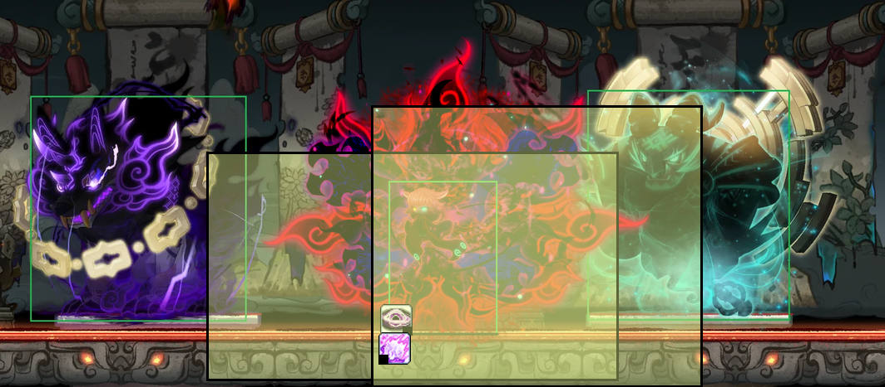

Attack hitboxes

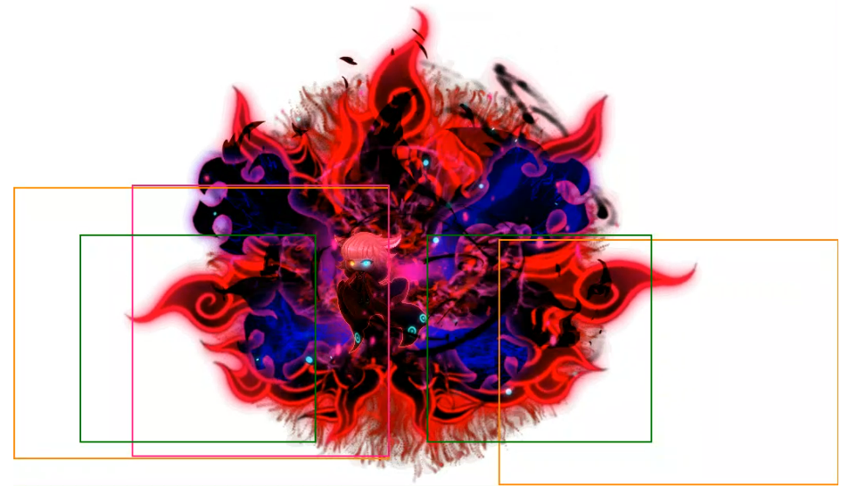

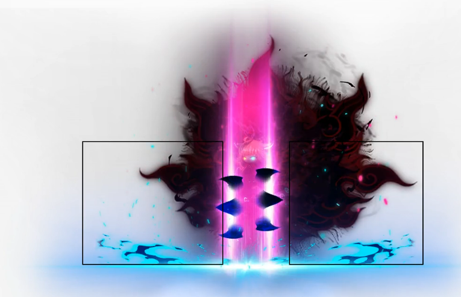

This is arguably the easiest phase to gain time back from lost burst timings but also the hardest unless you’ve already been holding Kaling. I had to spend a lot of time learning this phase and knowing what can 1 shot me, aka anytime Kaling decides to walk out of dog.

This will mainly cover dw and dog cheese specific strats, I would ask other members of your class who have cleared for more in depth stuff.

### Double Peril Bird/Dog Lineup

On entry you want to immediately turn on bird statue and true sight both animals. In the picture below you can see the lineup of where to stand to hit both dog and bird. **I would not bother trying to use the picture to line yourself up, the easiest way to do this is to check the damage number above dog to see if it’s appearing or the hitbox effect, and the hitbox effect on bird.** You do this by starting from the right and slowly inching yourself to the left until you see you’re in place. You can also upjump and hold left to move yourself pixel by pixel.

BENEFITS OF THIS LINEUP

- she will NEVER walk outside of dog, you can sip fountain and not have to worry about it ASSUMING you never reposition yourself to the left ever.
- yay no 1 shots
- your cosmic orbs still fly to bird

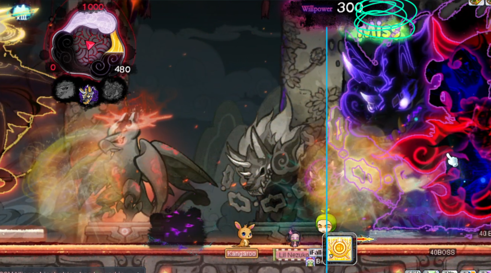

Majority of this phase is learning how to play with kaling on top of you and knowing when you can potentially get 1 shot. Pay attention to when your pot is grayed out because the dog chains will 1 shot you if she’s outside. You have to stand in a spot during your 60s where Kaling will likely walk outside. Her slam will 1 shot you and dog chains will 1 shot you too whenever she’s outside, so pay attention to those.

### Bird/Dog Lineup for Cosmos

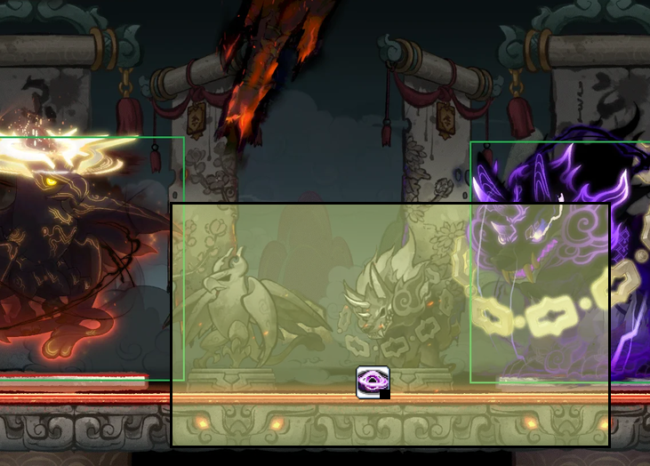

stand roughly on dog statue to hit both

My thought process was

- blink when you think you’re about to get slam and chains at the same time
- up jump her slam
- up jump her push outwards (most of the time)
- Inhale fountain, ALWAYS try to dodge into dog and only dodge into bird if you know the tornados aren’t going off. This applies to when you’re on the right cheesing tiger too, if you don’t know tiger’s lightning patterns you’re going to dodge into tiger, get stunned, and die.
- Up jump clutch if applicable

You’re going to have to do some runs experiencing with burst strats.

- Some runs I had to do 1-2 bursts from inside bird instead of all of them from inside dog. This is because bird had too much hp, it needs to be around 5-6% for it to die during the 6 minute origin. I think doing 2 bursts from bird is too much and then dog will have too much hp
- My clear run I was able to spare a burst from the left and directly burst into tiger which paid off in the long run in terms of unlocking her hp bars. I also didn’t have to do any bursts from bird and dog AND bird ended up dying at the same time. If you manage to get bird a lot lower like I did, then you do direct damage to Kaling with that origin too instead of some of the ticks being into her segmented hp.
- I think if your double peril is good enough, you don’t ever have to burst from bird.

### Bird/Dog Burst Lineup

This is the lineup below to hit dog, bird, **AND HAVE YOUR COSMIC ORBS FLY INTO BIRD. Look at how my head is lined up with the leftmost chain of dog, or go into practice and find a lineup on the floor. Having the orbs fly into bird is very important for damage because otherwise they will fly into Kaling and be lost damage. You can tell if they’re flying into bird by looking at all the explosions on the left**

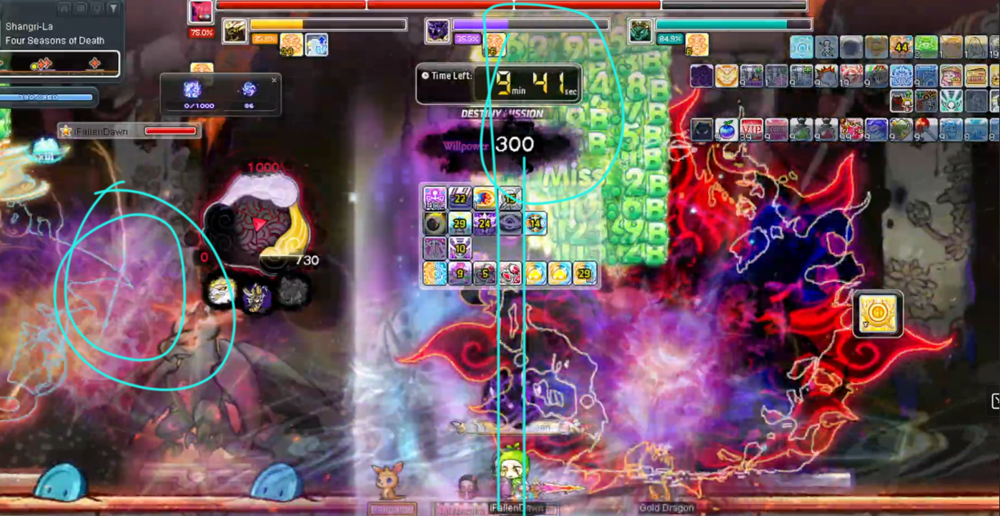

**Make sure everything is true sighted in advance before your origin bursts**, specifically the animal that you’re not bursting into across the map (tiger or bird).

When you unlock her 1 shot stun slam, understand that if you’re completely tp’d across the map and out of range, she will likely cast it immediately as you re-enter that hitbox and you don’t have enough time to walk across her to dodge it. So be weary of that and dash + equinox slash across or bait it out before walking back in. Would reference the hitbox guide to see the hitboxes of everything, they all roughly have the same cd so expect her to use them in succession and dodge all of them.

For a comfy run, tiger dies well before the 2 min burst. For a closer run it needs to die during or a little after the 2 min burst and so you don’t bleed a lot of damage into segment. I think in the run I timed out, if tiger died earlier and I had more time for my last burst it was a 6 burst clear. 

My practice sessions for this was to speedrun there in easy kaling, take off symbols/gear, and pay attention to everything + build awareness of when she stepped out. Knowing the double peril lineup for basic attack helps a lot with damage.

**I think every dw should try getting bird down to 3-4% before switching over to tiger side and lining up Kaling during that 6 min origin burst. 5-6% is the minimum for bird to die to origin, but it’s better to have some of that damage bleed into Kaling imo.**

### When to switch sides from left to right?

Assuming left start, generally switch when bird is below 5% hp. This happens before the 6 minute origin burst and around the 8 minute burst (and if not your damage uptime was not good enough). You just need bird to die on that 6 minute burst and at max origin it dies when it's below 6%. I like to get it lower so it dies before the last tick of origin and some damage goes into Kaling though.

### Tiger Lineup for Cosmos/Origin/Basic attack

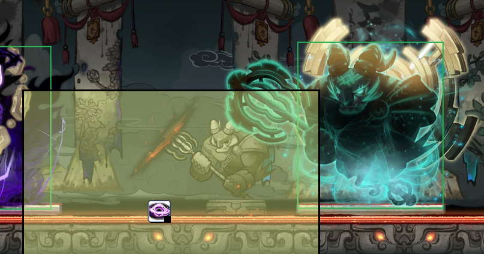

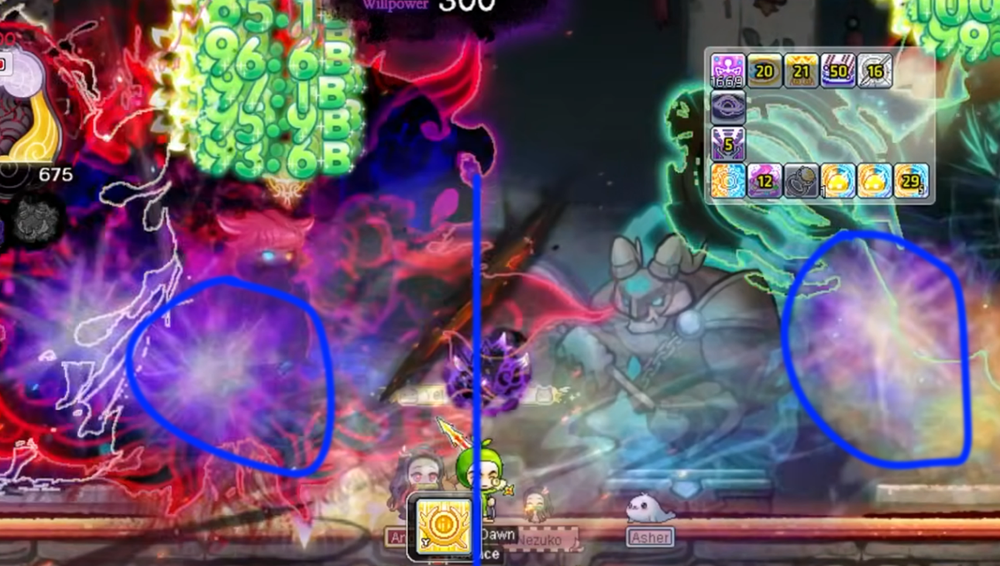

**Cosmos -** Make sure you are under the center or a little to the right of the crack in the screen. Look for the purple circled effects to see that cosmos is hitting both, otherwise you’re losing a lot of damage

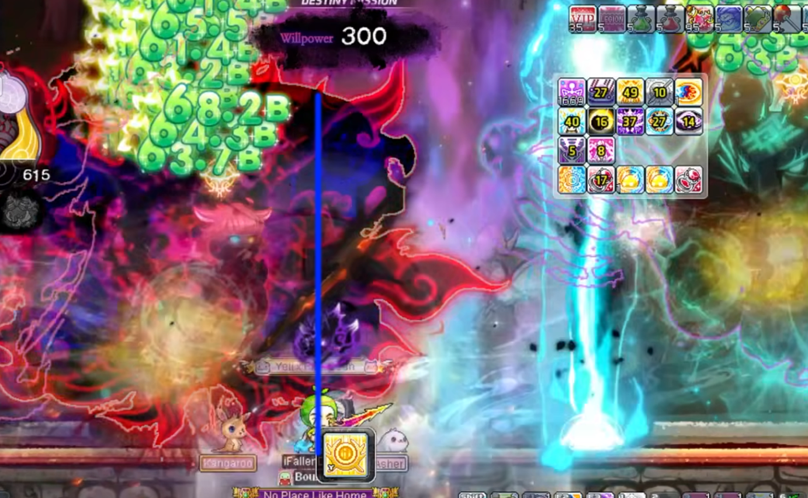

**Origin** - make sure you are a little left of the center of the crack to ensure bird gets hit by origin. Walk back into the cosmos lineup after. The farther left you are the safer it is to make sure bird dies to origin. Ignore where kaling is in this picture, **you want her lined up to the right or on top of you for Rift to hit**

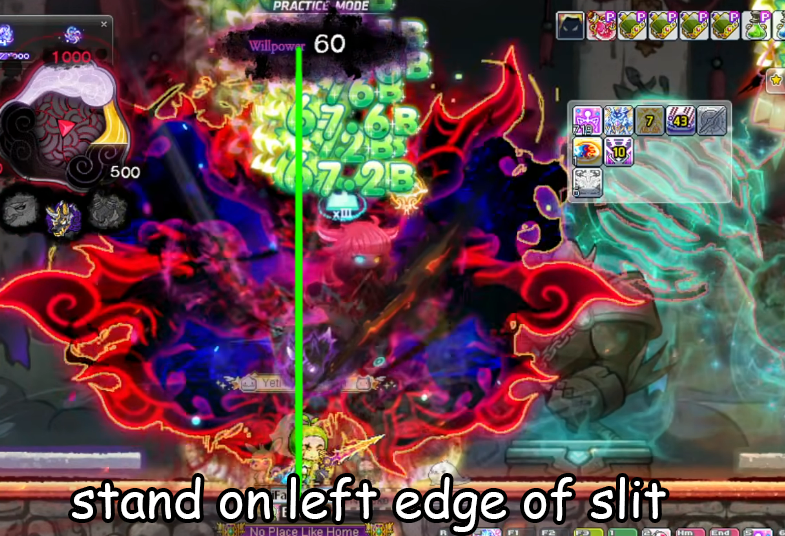

If you stand on the left edge of the slit, she will be a lot less likely to walk out. **She can still walk out but this is max range for basic attack, watch your pot cd**

#### P3 - Tiger First

If the left side strat doesn’t work out for you, you can try killing tiger alone first. 

```bash
killing tiger first in p3 allows you to start damaging kaling directly as early as 8 mins left if you lack damage to do the left side first since that one only start damaging at the 6 mins origin which might not be for everyone
```

the route would be something like

- tiger statue on, kill tiger.
- dog statue on, kill dog
- bird statue on, kill bird

Bird still needs to die around the 1:30-2:30 minute mark for it to be on pace. Kaling also still needs to be lined up during the bursts that aren’t into the hp segments

your double peril lineup on the left still needs to be on point and is arguably harder with kaling having another attack

### P3 FMA

If you have sol hecate at level 20, your sol hecate door IFRAMES YOU FROM HER FMA TEST, SO YOU CAN USE THIS TO YOUR ADVANTAGE IF DAMAGE IS FALLING BEHIND. Your origin iframes you too! REMEMBER HER FMA HAS A LINGERING HITBOX DO NOT JUMP BACK IN TOO EARLY, but she is also still targetable during it! **FMA HITS THROUGH EVERY OTHER IFRAME**

- If you bind before fma, it’ll delay that specific fma but won’t delay the one after.

```bash
if u bound right before its fma, it does delay that fma, but it doesnt delay future fmas
so in ur scenario, it was supposed to fma at xx:39-40, but u bound right before, 20s later, fma'd at xx:20, but it doesnt delay future fmas, so the next fma was xx:09-10 

```

## More Tenpai Notes

Tenpai - some of my notes to supplement the video:

p1 bird:

- you can get bird to slap you multiple times after unbind by standing to the side of him and iframe dashing to the other side, this keeps you in range of his attacks so bird will almost always do 2/3 attacks before first fly
- if bird flies bottom on first fly, you should play bottom instead of standing top. you need to get bird to attack you so that he doesn't insta fly so that cosmos will come up right as bird finishes 2nd fly
- when bird lands after 2nd fly, you also want to be standing perma in range of his attacks (i.e. to the side). bird will hide the moment you arent in range
- if bird flies bottom on the fly right before 2nd burst, you should play top instead so that you force the fly asap

p1 tiger:

- you need coils to activate the moment burst starts but you can activate coils ~13s before minis start. the idea behind double coil is that you can have ~45s to setup coils after minis and only ~30s to setup after burst.

p1 dog:

- if you are playing 5 burst+1 ascent then the origin on dog is pretty much compulsory, origin late is fine because your burst cycle in p2 would be the same as p1 bird where you only origin 10s into burst anyway. so the cds will line up

p2:

- IMO you can afford to chase kaling to start every burst, your burst cycle is 5s sun iframe -> gene iframe -> 5s cut sun iframe -> kaling flies away, so you should never have an issue bursting anywhere on the map

p3:

- i think you don't have to do the burst on tiger while all 3 perils are alive. the main consideration is that it's hard to keep dps uptime on tiger when bird/dog are dead since kaling spams attacks on you, but you'll end up in the scenario where kaling is ~35% hp when tiger is dead if you do the extra burst on tiger. you can probably just afford to kill bird/dog before you work on tiger to not have any 'wasted' damage
    - jordan post note, i agree with this completely

# Closing

Hope this guide helps you clear! if it does, feel free to ping me or shoot me a message, or if you want guidance just dm me! preferably send me a vod too + what you think you are struggling with.

# 6 burst notes from James

[https://www.twitch.tv/videos/2653910816?t=1h49m56s](https://www.twitch.tv/videos/2653910816?t=1h49m56s) - vod died

this run was a solid 6 burst attempt, i came in with only 22 mins on wedding and LC, since i had to re-enter.

the goal is to kill bird with ori and burst tiger on the 2nd ori burst of p3 with this method. also the goal in p2 is to get in basically immediately after burst so you can chip and do 60s (i had to chip like 4% left in p2 so my burst got delayed)

you can see on the 2nd ori burst of p3 bird was at 11%. from my runs 6% is kill range of origin. so if i had gotten it to 6% and used that burst on tiger instead of finishing bird off it would've been on pace for a clear i'm pretty sure (assuming i got out of p2 faster)