# Malefic Star

## Video Version

WIP one day I'll make one lol, at least after I clear. Probably sometime in September or October.

## Upcoming Boss Changes

[2026/07/31 Orangemushroom patch notes](https://orangemushroom.net/2026/07/31/kms-ver-1-2-417-maplestory-overdrive-3rd-hexa-skill-core/) 

Boss patterns will be disabled when Malefic Star is bound, meaning **bind is very useful in illusion room**.

## Inven Hitboxes/Useful Links

All hitboxes will be taken from these links.

[Maple inven post on Malefic Star map patterns](https://www.inven.co.kr/board/maple/2304/46866?p=2&category=%EB%AA%AC%EC%8A%A4%ED%84%B0) - Every picture below is taken or modified from this.

[Maple inven post on Malefic Star attack patterns](https://www.inven.co.kr/board/maple/2304/46868?p=2&category=%EB%AA%AC%EC%8A%A4%ED%84%B0)

[Min clear fd maxing strategies](https://www.inven.co.kr/board/maple/2304/46867?p=2&category=%EB%AA%AC%EC%8A%A4%ED%84%B0) - Min max strategy theory. This is the strat we’re going to be following

Will not be covering most boss mechanics, can watch [Kobe’s guide](https://youtu.be/3Lk5_0yNXJA?si=SoCKVNmu0VwnntG2)

## Reference Runs

[Jordan's -4 hat simulation in test server](https://youtu.be/Tc44ILPRYbk)

[-2 I/L min clear](https://www.youtube.com/watch?v=kkuy3Shxcpk) - I/L route played pretty much perfectly besides one mistake. He is running -2s cd hat.

[No cd hat 30 minute simulation](https://youtu.be/Ol4V4HnAW2s)

[Goated 122.7k Hero Solo -2 hat](https://youtu.be/fJ6c1_w7Fzc?si=daMXE_AKZRbsan0p)

## Guide Notes

This is a guide going in depth about the min clear burst route. The triangle wave patterns might be useful to know too, there’s a relatively safe spot (as in only one triangle wave from the 2nd wave) will hit it that I marked!

KMS clear search term `하드흉성 솔플`

## Forcing Essence of Illusion Spawn

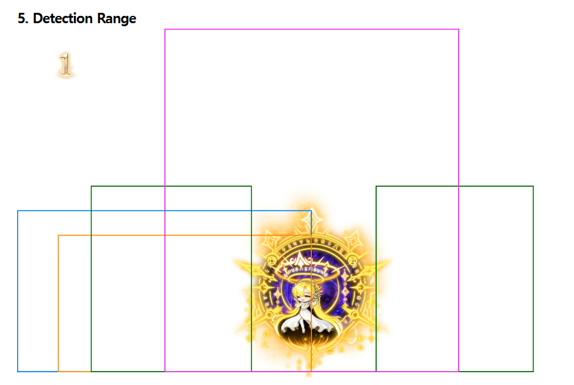

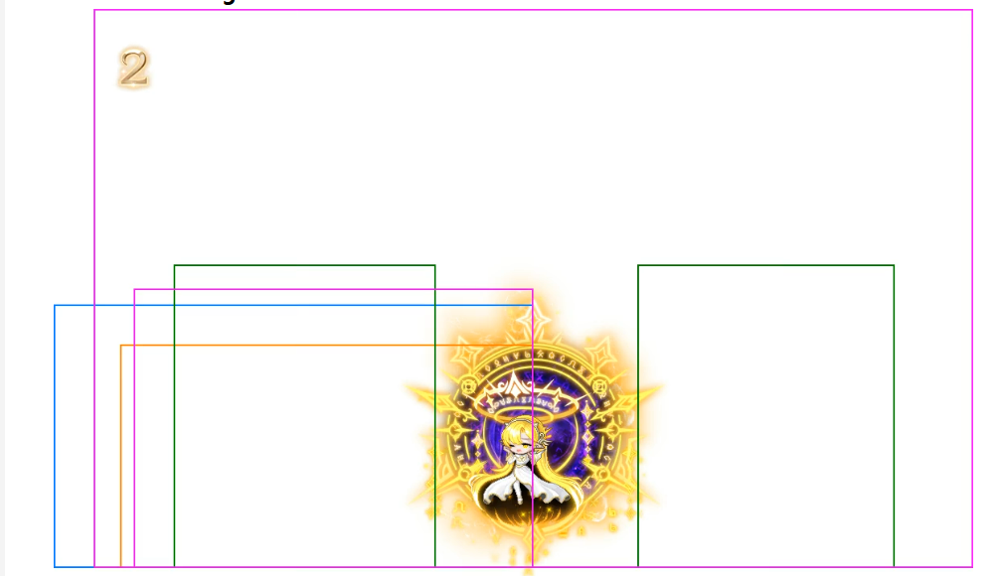

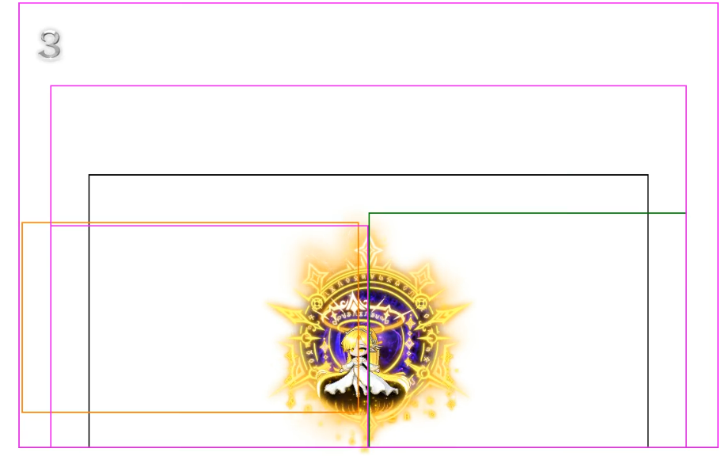

```bash
Google translated
What is important to look at here is purple This is a pattern marked with . It is a pattern that summons the Essence of Illusion, and the Breath of Radiance pattern has a full detection range.
The detection range of the Phase 1 Starlight Echo pattern and the Phase 2 Enhanced Starlight Echo pattern are different. Since Phase 1 is quite narrow, you can control the cycle of the Essence of Illusion by adjusting your distance from the Malefic Star.
```

Pretty much, look at the purple areas to force spawn of the essence. This can be abused in P1 to either delay or force the spawn. If you play out of range of the spawn, you delay it. If you play in range, you can force it.

## How Much Time Do You Need To Cleanse Essence Attacks

The center of the gauge in illusion shows you how long it takes until the next essence spawns. Besides entry (which is roughly 23s), it should always take 15 seconds assuming you don't delay the spawn of the essence at all.

P1 essence → 2-3 seconds minimum

P2 essence rush → 3 seconds minimum

P3 dodge laser then in laser → 8 seconds minimum. 2 essences

P3 meteor shower → 8 seconds maximum. May be less if you get early essence spawn. 2 essences.

P3 essence rush → 6 seconds minimum.

**You can bind as soon as you see the empty essence spawn. For the two essence patterns, bind as soon as you see the second essence. The essence will still activate.**

### Example of Essence Cleanse Timing

I’m in p1. My reality timer is ticking down with 130% fd and is at 20s left. essence spawns at 20s, I know I can take another right, maintain fd, and not get punished because I can force another essence spawn + altar at 5s to immediately grab left.

More often than not for the 26 minute burst, you're going to have to skip cleansing an essence entirely (1 min left on reality timer and you're at 115% fd). You would skip the orb that spawns, then take another right for 130% fd and to lineup the last 40s with the 40s of the overall room timer. This is so that you don't screw up your essence cycles and delay burst by waiting for 130% fd.

I’m in p3. My reality timer is ticking down with 130% fd and is at 20s left. essence spawns at 20s, I know I CANNOT risk taking another right because next essence spawns in 15s when there’s 5s left, and there’s a chance I get a pattern that takes too long to spawn altar.

## Min Cut Route Notes

These are notes I compiled about the route while screwing around on test server, subject to change.

Key notes

- Try your best to not get hit at all in illusion room. You want to switch back to reality and get instant orb spawn when there are 45s left on your 60s cds.
- If you delay essence spawn (by getting hit too many times in illusion), it fucks your cds and you might have to burst with 120% fd instead of 130%. The only cases you can get hit is if you want to intentionally delay the orb spawning so you can get instant spawn switching from illusion to reality.
- Altars last 7 seconds from when you cleanse essence, you have to get used to counting down that timer and delaying when necessary
- In reality, kite star to wherever the whale is not. Or keep her centered.
- **Reality room has 15s cd on essence no matter what**
- In reality room, **DO NOT GET HIT BY ANY ATTACKS THAT GIVE YOU GAUGE, ESPECIALLY WHEN YOU ARE SWITCHING BACK FROM ILLUSION. Also means that you can tank everything else.** This is because after cleansing 2 orbs in illusion and switching back to reality, if you get hit too many times by attacks that give you gauge it will start the 40s timer early and screw up your 130% fd burst. Attacks that give you gauge:**
    - Purple whale lightning
    - Any of Star’s attacks
- **I think route is doable without cd hat and just 250 mercedes.** CD hat just lets you get hit more often in illusion if you weren't going for 17 burst.
- If star is bound, she CANNOT spawn essence. You can use this to your advantage if you want to use styx or regular bind to delay essence spawn to maximize fd.
- **You cannot cleanse while in the middle of an animation. This is not like adversary parry, you actually have to pause what you’re doing to interact.**
- **You can skip essences completely if that screws up your burst timing with 130% fd, ex: around 26:30**

I want to say this route doesn’t change with 17 burst strategy but I am speaking with no experience. My theorycrafting is with -4cd hat + not delaying altars or whatever, you should still be able to 17 burst and follow this route. **It just means if you want to guarantee 17 bursts with 130 fd, you have to play all illusions perfectly.**

I am using -2s hat + wings of fate to get my 60s cds down to 56s in test server. Best I can do without 250 mercedes, but it should be significantly more leeway/easier with cd hat and mercedes. CD hat does give you some leeway later on with how often you can get hit/delay bursts, but if you play perfectly nothing should ever be delayed and you don’t have to delay any altars.

**You are allowed to get hit ONCE during the ori + styx + regular bind. but you cannot get hit after that. Need that essence to spawn as soon as she is unbound**

Entry → Pop burst immediately. This includes using hecate styx to extend the bind timer to 24s. **This will delay essence spawn and helps you + damage from styx**

First essence spawns at like 29:30 or whenever you stand in her hitbox (stand in the hitbox). Cleanse first essence immediately. Dodge everything until RIGHT before 2nd essence spawns. As in, when your purple gauge is about to fill. Should be swapping around 29:14 on the clock. **If you swap earlier, then you won’t have time to get the 3rd burst off in reality.**

Reality pacing is dependent on if you have cd hat or not and whenever she decides to spawn the first essence. The general route is right (105% fd) → right (120%fd) → left (105% fd) → right (120% fd) → right (130%fd) and repeat. This will likely have to change on the fly and you have to do math very quickly to account for it.  Whenever your yellow gauge is full, the 40s countdown starts.

If you get hit in reality too many times by stuff that gives you yellow gauge and fuck up your gauge/go into 40s mode too early, your run is over too IF the cooldowns don’t line up. But you would lose fd from getting to that 40s through getting hit instead of altar.

You can play around with hitbox manipulation to get her to spawn essence as fast as possible by standing in the hitbox, because if she spawns it quick, you can get 120% fd on your 60s.
    
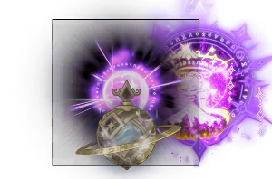
    
The reason it’s dependent on cd hat and when she spawns essence is because it dictates how much you have to delay taking the altar to give you enough time during that 40 second window of 120 or 130% fd to get your entire burst out. You have to keep looking at your burst cds and checking “okay will this line up in that 40s window”
    - In the I/L route, he enters 29:14 and his first reality essence spawns at 29:04. He cleanses essence at 29:02, then grabs altar at 28:56 before it expires and immediately does his 60s. **Notice the window he delays altar at 29:02-28:56, and how it starts the 40s timer.** Next essence spawns at 28:49. Break at 28:46 and he grabs immediately for 120% fd.
    - In my run, I enter 29:12 and first reality essence spawns at 29:09.  Second essence spawns at 28:51 and I grab altar immediately to get 120% fd on part of my 60s.
        - You likely NEED to delay grabbing altars to some extent after these and maximizing the timer, both for FD and so that you have enough time to get the 3rd burst off.
    - After that 60s, grab left as close to end of 40s timer as possible. Next is right (delay this right as much as possible too) → right for 130% on 28 min burst. End burst with grabbing left as close to expiring 40s window.
    - For the 60s at 27 mins, you grab right twice and stack 130% fd → 130% fd. Next essence should be left as close to expiring 40s window as possible → 115% fd. Should be around 50-60s left on the clock. Next essence is right → 130% fd.
    - To prep 3rd burst 26 mins left, you want to grab left 115% fd, then **SKIP THE ESSENCE**, then grab right to go back to 130% fd and burst.
        - Be careful of binding and not letting her spawn essence, but if you miss this burst the run might be over.

Back in illusion room cleanse twice, get your 60s off, and **delay switching to reality again until 45s left on your 60s cds**. The priority here is to switch back to reality after the 2 cleanses and the delay, don’t worry about losing fd on 60s. Try not to get hit otherwise you delay your essence spawns and everything else. 

I/L gets into illusion at 25:35 left on clock. First essence at 25:24. Second essence at 25:06. Switches back to reality at 24:55. Spent about 40s in illusion. I think you want to switch back to reality around 40-45s left on cds for your burst to come back up, so you have enough time to grab 3 rights.
    - I want to say he’s intentionally getting hit sometimes after 2nd essence spawn to delay next spawn, so that he gets proper timing for essence spawn in reality and his cds line up.

When you switch back into reality, **DO NOT GET HIT BY ANYTHING THAT GIVES YOU GAUGE. You want to make sure you are able to cleanse right 3 times and have 130% fd AND enough time for origin burst at around 24 mins.** If you get hit by attacks that give you gauge, it might put you into the 40s timer too early and screw up your burst timer for 30% fd. Grab left as close to 40s window expire as possible.

Seems like proper pacing at least for the I/L is hitting p2 (80% health left) on that 24 min origin burst.

Depending on your pacing, you might need to skip binding the boss here for the 22 min burst. Grab left before it kicks you out.

You end up repeating the same route for the rest of the run. Illusion 2 orb cleanse, switch back on 45s left on cds for 60s.

A general note is right -> right -> left but it will be heavily dependent on all the math you have to do. How long you need to stall altars, how long until burst, when the next essence will spawn, etc.

P3 pacing is 40% left at around 12 min burst.

## Rush vs Black Hole essence Thingy

Top is black hole essence, bottom is rush. The way I like to tell the difference is position of the circle in front (middle vs towards the ground), or the gold vs purple/black behind her (gold is essence, purple/black is rush)

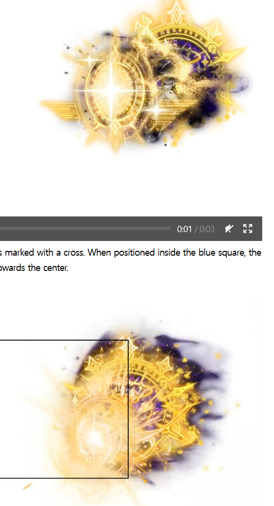

## Triangle Wave Patterns

I think the spot in the pic below is op, and you only have to worry about dodging triangles when it’s **left to right** and it’s the second wave (which starts at 80% health left). This won’t save you from other map patterns though.

Generally can treat them like will legs tho, as in dodge into one after it disappears

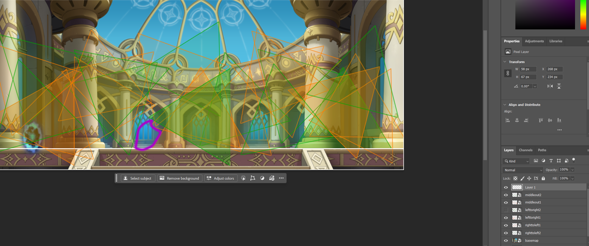

### All Wave 1

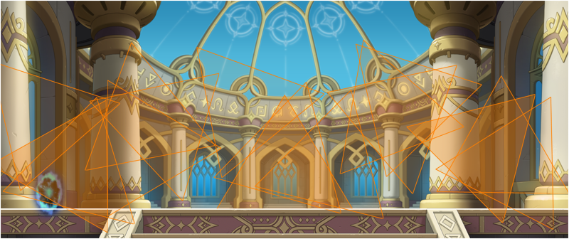

Safe spots below

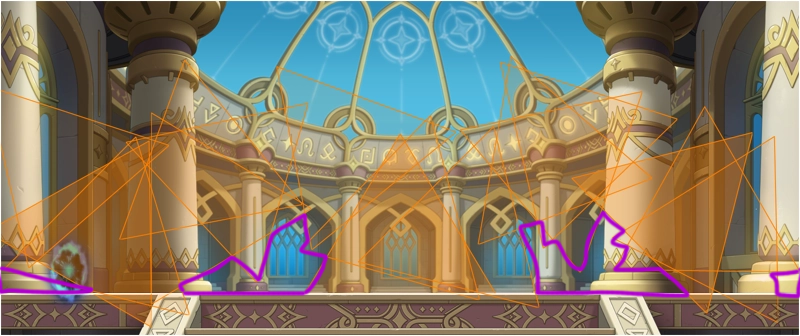

### All Wave 2

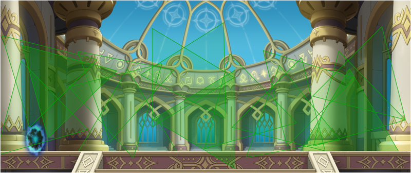

### Both waves overlayed

There are no safe spots lmao

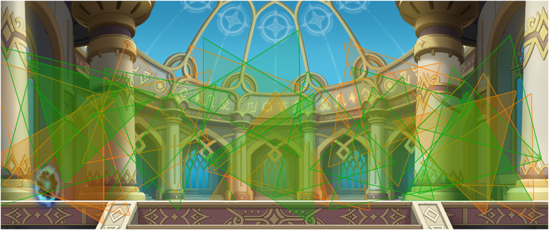

### Left to Right


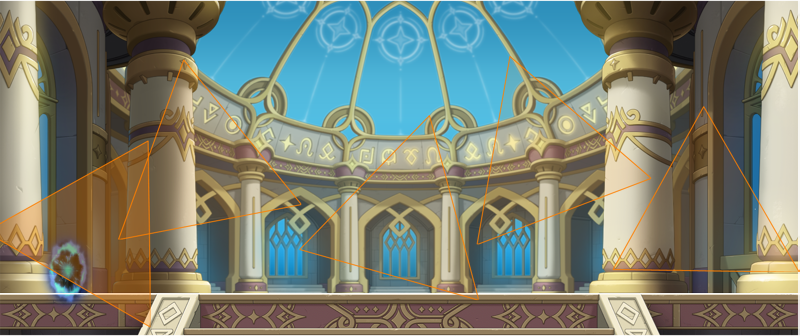

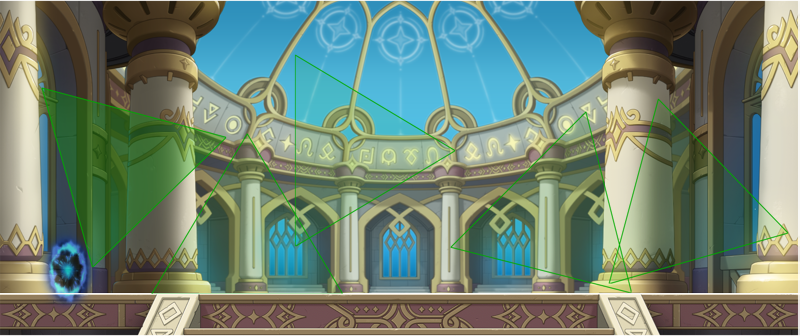

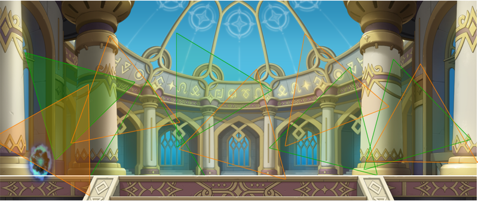

### Middle to Out


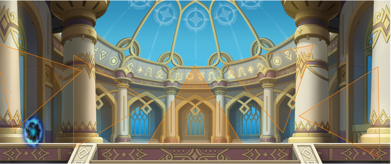

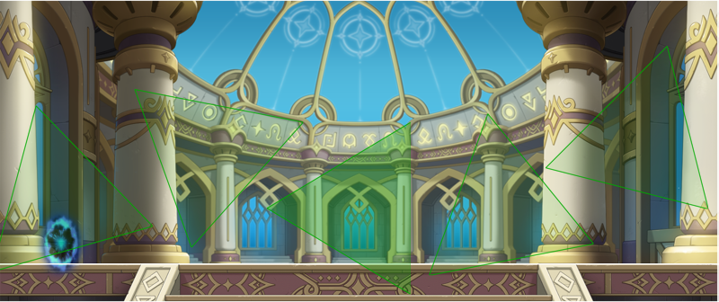

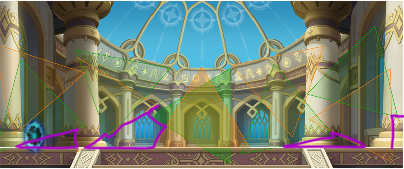

### Right to Left


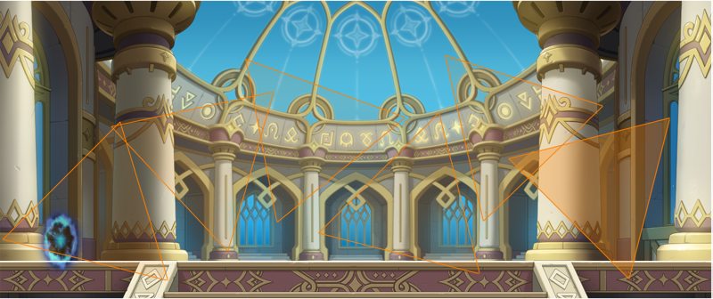

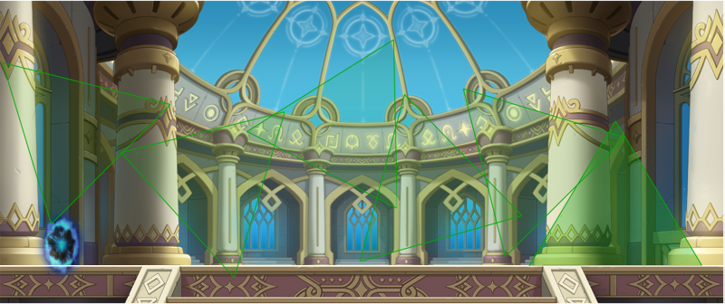

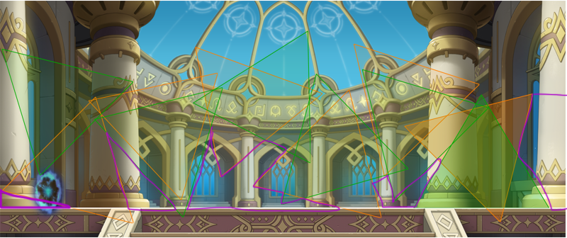