# Malefic Star

## Video Version

[VIDEO VERSION HERE](https://youtu.be/1LpamYlpCzw)

## Upcoming Boss Changes

[2026/07/31 Orangemushroom patch notes](https://orangemushroom.net/2026/07/31/kms-ver-1-2-417-maplestory-overdrive-3rd-hexa-skill-core/) 

Boss patterns will be disabled when Malefic Star is bound, meaning **bind is very useful in illusion room**.

## Inven Hitboxes/Useful Links

All hitboxes will be taken from these links.

[Maple inven post on Malefic Star map patterns](https://www.inven.co.kr/board/maple/2304/46866?p=2&category=%EB%AA%AC%EC%8A%A4%ED%84%B0) - Every picture below is taken or modified from this.

[Maple inven post on Malefic Star attack patterns](https://www.inven.co.kr/board/maple/2304/46868?p=2&category=%EB%AA%AC%EC%8A%A4%ED%84%B0)

[Min clear fd maxing strategies](https://www.inven.co.kr/board/maple/2304/46867?p=2&category=%EB%AA%AC%EC%8A%A4%ED%84%B0) - Min max strategy theory. This is the strat we’re going to be following

Will not be covering most boss mechanics, can watch [Kobe’s guide](https://youtu.be/3Lk5_0yNXJA?si=SoCKVNmu0VwnntG2)

## Reference Runs

[121689 Dawn Warrior No CD hat clear](https://youtu.be/JZVSTqGzlOg)

[17 burst timeout shadower](https://youtu.be/tKMnVkYAZSg)

[Goated 122.7k Hero Solo -2 hat](https://youtu.be/fJ6c1_w7Fzc?si=daMXE_AKZRbsan0p)

[-2 I/L min clear](https://www.youtube.com/watch?v=kkuy3Shxcpk) - I/L route played pretty much perfectly besides one mistake. He is running -2s cd hat.

## Quick Overview

I would say the hardest part of this boss is knowing how to adjust on the fly based off your cd timers and the essence timers. It doesn't really feel like there's a concrete "oh everyone can just follow this blueprint" because you have to adjust based off all the timers.

- Try your best to not get hit at all in illusion room. **You want to switch back to reality and get instant orb spawn when there are 45s left on your 60s cds.** 40-45s is the sweet spot, but I found 45s to be more lenient in the event she doesn't spawn essence instantly or decides to her longest patterns
- If you delay essence spawn (by getting hit too many times in illusion), it fucks your cds and you might have to burst with 120% fd instead of 130%. The only cases you can get hit is **if you want to intentionally delay the orb spawning. Pay attention to your 60s cds.**
- Altars last 7 seconds from when you cleanse essence, you have to get used to counting down that timer and delaying when necessary
- In reality, kite star to wherever the whale is not. Try to keep her as centered as possible.
- **Reality room has 15s cd on essence**
- In reality room, **DO NOT GET HIT BY ANY ATTACKS THAT GIVE YOU GAUGE, ESPECIALLY WHEN YOU ARE SWITCHING BACK FROM ILLUSION. Also means that you can tank everything else. It is equally as important to not miss any of the first 3 essences in the room.** This is because after cleansing 2 orbs in illusion and switching back to reality, if you get hit too many times by attacks that give you gauge it will start the **40s eating timer** early and screw up your 130% fd burst. Attacks that give you gauge:**
    - Purple whale lightning
    - Any of Star’s attacks
- **250 mercedes link is required.** CD hat just lets you get hit more often in illusion and fix your cooldowns to align with 130% fd if you weren't going for 17 burst.
- If star is bound, she CANNOT spawn essence. You can use this to your advantage if you want to use styx or regular bind to delay essence spawn to maximize fd. **DO NOT HAVE STYX ON AUTOCAST.**
- **You cannot cleanse while in the middle of an animation. You CAN cleanse essence mid flash jump. This is not like adversary parry, you actually have to pause what you’re doing to interact.**
- **You can skip essences completely if that screws up your burst timing with 130% fd (as in if you have over 20s left on your cds), ex: around 26:30**. Specifically for the burst at roughly 26 minutes, I wouldn't bother skipping if and only if there is 40 seconds left on the overall room timer. 
- Taken from Chodari's notes, for the 20 minute burst and some ending reality bursts as well, you want to stall a little bit in reality before switching back to illusion so you can get instant essence spawn. Since we know that it's 15 seconds between each essence, you can min max that timing too.
    - A good rule of thumb would be 1-2 attacks after she spawns the essence, but it is dependent on which pattern she does. This is covered here [How Much Time Do You Need To Cleanse Essences](#how-much-time-do-you-need-to-cleanse-essences)
    - Each attack is roughly 4-5 seconds so I tend to wait until the end of the animation of her first attack or mid animation of the 2nd attack after she spawns the essence
- Saving Genesis/Destiny iframe for illusion room is a viable strategy, I ended up doing this because I'd rather not lose my runs to poor illusion rooms when it's easier to play better in reality
- I think **the illusion after the 18-18:40 origin burst is the most important illusion.** Through all of my practice, if you get hit at all in this one it will always delay the essence spawns too much to make a comfortable 130% fd burst on the switch back into reality.
- For P3, if you miss a double essence pattern and only grab 1/2 the essences, that means for the next double essence pattern, the altar will spawn even if you only grab the first essence. If you manage to miss the second essence again, then you gamble on whichever the altar chooses between left and right after it expires.
    - This has saved me once in practice

## Guide Notes

This is a guide going in depth about the min clear burst route. The triangle wave patterns might be useful to know too, there’s a relatively safe spot (as in only one triangle wave from the 2nd wave) will hit it that I marked! [Triangle Patterns](#triangle-wave-patterns)

**All timings are referring to the timer left in the boss.**

KMS clear search term `하드흉성 솔플`

## Forcing Essence of Illusion Spawn

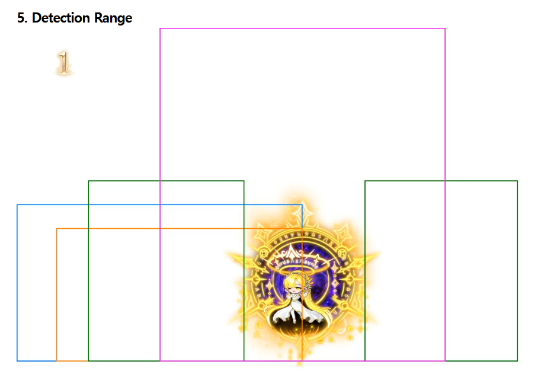

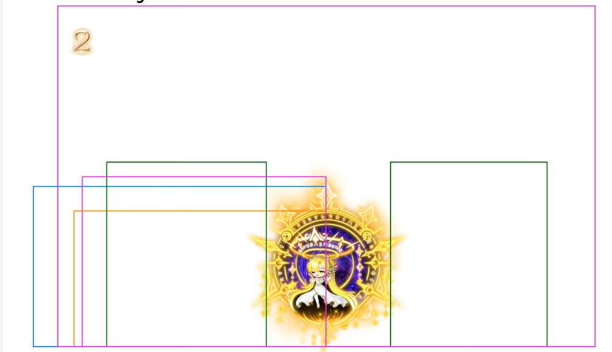

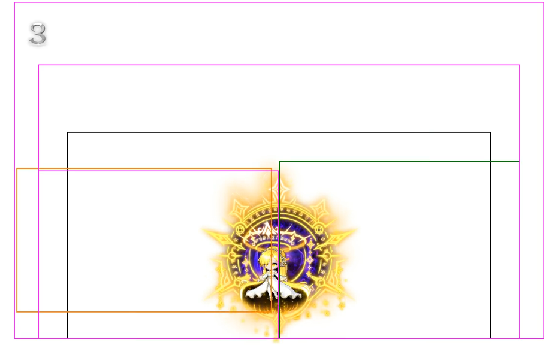

```bash
Google translated
What is important to look at here is purple This is a pattern marked with . It is a pattern that summons the Essence of Illusion, and the Breath of Radiance pattern has a full detection range.
The detection range of the Phase 1 Starlight Echo pattern and the Phase 2 Enhanced Starlight Echo pattern are different. Since Phase 1 is quite narrow, you can control the cycle of the Essence of Illusion by adjusting your distance from the Malefic Star.
```

The giant purple rectangle around her in the first picture is the essence hitbox, though from my experience it seems more consistent if you just stand on top or directly in front of her.
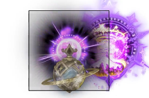

Look at the purple areas to force spawn of the essence. If you play out of range of the spawn, you delay it. If you play in range, you can force it. **This means you can also fish for certain patterns to come out in the other phases.**

I cover this a bit in my Kaling guide but you can use hitbox manipulation to force her to spawn the essence as well. If you permanently stand in front of her and force out all of those attacks before essence spawn timer is up, you can guarantee her next attack will be the essence. Same applies to any of her other attacks.

## How Much Time Do You Need To Cleanse Essences

The center of the gauge in illusion shows you how long it takes until the next essence spawns. Besides entry (which is roughly 23s), it should always take 15 seconds assuming you don't delay the spawn of the essence at all.

P1 essence → 2-3 seconds minimum

P2 essence rush → 3 seconds minimum

P3 dodge laser then in laser → 8 seconds minimum. 2 essences

P3 meteor shower → 8 seconds maximum. May be less if you get early essence spawn. 2 essences.

P3 essence rush → 6 seconds minimum.

**You can bind as soon as you see the empty essence spawn and it will still activate. For the two essence patterns, bind as soon as you see the second essence. The essence will still activate.**

An example of essence skipping and attack waiting would be [here in my clear](https://youtu.be/JZVSTqGzlOg?t=680). This is the last burst in reality before I switch back to illusion. I skip 1 essence because my burst cds are over 20s and the origin burst timing would have been too tight. At 12:26 I wait 2 of her attacks (her orb spawning aoe, and her front push) before swapping back to get the instant essence spawn.

### Example of Essence Cleanse Timing

I’m in p1. My reality timer is ticking down with 130% fd and is at 20s left. essence spawns at 20s, I know I can take another right, maintain fd, and not get punished because I can force another essence spawn + altar at 5s to immediately grab left.

More often than not for the 26 minute burst, you're going to have to skip cleansing an essence entirely (1 min left on reality timer and you're at 115% fd). You would skip the orb that spawns, then take another right for 130% fd and to lineup the last 40s with the 40s of the overall room timer. This is so that you don't screw up your essence cycles and delay burst by waiting for 130% fd.

I’m in p3. My reality timer is ticking down with 130% fd and is at 20s left. essence spawns at 20s, I know I CANNOT risk taking another right because next essence spawns in 15s when there’s 5s left, and there’s a chance I get a pattern that takes too long to spawn altar.

## Min Cut Route Notes

The goal of this route is to have 130% fd for every burst (except the entry one).

I want to say this route doesn’t change with 17 burst strategy but I am speaking with no experience. My theorycrafting is with -4cd hat + not delaying altars or whatever, you should still be able to 17 burst and follow this route. **It just means if you want to guarantee 17 bursts with 130 fd, you have to play all illusions close to perfect.** Perfect meaning swapping at the correct times and getting the correct essence spawns.

**You are allowed to get hit ONCE during the ori + styx + regular bind. but you cannot get hit after that. Need that essence to spawn as soon as she is unbound**

Entry → Pop burst immediately. This includes using hecate styx to extend the bind timer to 24s. **This will delay essence spawn and helps you + damage from styx**

General rule of thumb for reality is **right -> right -> left -> right -> right, but you cannot solely rely on this pattern.** Leave every illusion after 2 cleanses AND there are 40-45s left on your 60s cds AND intentionally keeping gauge close to max without her spawning the essence.

Proper pacing is roughly between 80-81% before the 24 minute origin burst, and hitting p3 40% during the 12 minute origin burst.

It's a lot to remember when you're learning the route initially and will take a lot of practice. Being able to multitask and keep track of timers is a necessity.

### Vod Reviewing My Run

[Run for reference](https://youtu.be/JZVSTqGzlOg)

The first 3 essences when swapping back into reality (not including your first reality) are **UNMISSABLE** to ensure 130% fd. Otherwise your burst will get massively delayed.

Burst on entry. **Cleanse one essence and swap once the gauge is close to being full**. I skipped styx because it gets her to spawn the essence faster. Getting hit once there did not matter too much, it just means I miss part of the 120% fd for 60s at 28:52. If you get hit more than once, you likely have to re-enter.

On entry to reality, grab 2 rights to get 120% fd. You don't have to count down the first altar when you are at 90% fd, as you want to get back to regular or 105% ASAP. So specifically the sequence between 29:07 -> 28:34 shows how you can immediately grab two rights to get 120% fd, and then countdown the max timer to grab left. 

28:25 -> 27:24. The next goal is to grab 2 rights to get 130% fd. You want to **stall taking the first altar to the max to account for your burst, as you don't want to start the 40s timer too early.** You can instant grab the second one to put yourself at 130% fd for the burst. I'm looking at the 40s timer for this and saw she spawned essence at 00:32. This means the next one will spawn at roughly 00:17. I caught her mid animation when 00:17 rolled around, so I chose to bind to stall that essence spawn even longer for my 10 hour burst. This means that bind wears off at around 00:07 and then she can spawn essence. **I should not have styxed to extend the bind as that was very greedy, I should have used it there to bind when she spawned essence for a safe altar grab and cleanse.** Grab left to go back down to 115% fd.

27:12 -> 26:30. Grab right for 130% fd for the 60s minis, then grab another right just to extend the timer and maximize fd. Grab left to go back down to 115% fd. She spawned it at 26:39. Next spawn is roughly at 26:24.

At 26:31 I grab the essence. Notice how there is 00:56 left on the timer and my burst has 27s left on cds. If I grab the essence or force a spawn at 26:24, it will make my burst window very tight. But **because I play out of range from her essence spawn, she cannot spawn it and it's effectively the same as skipping an essence.** Depending on your class, you will likely have to spawn that essence anyway and skip it to make sure the burst window isn't super tight.

Specifically for this burst too, you can grab the essence the second you see 00:40 on the clock because that overall reality room timer will override anyway and your timer won't go back up to 00:40, even if you grab right at 00:34.

Burst. **I am intentionally skipping gene so I can use it in illusion if needed.** She spawns essence at 25:44. I know the next one will be at 25:29. If you wait out the full timer and you are not in the hunger reality mode or whatever it's called, it will auto swap you back without eating you. Here I wait one attack and swap over for the instant essence spawn.

25:30 -> 24:50. I actually get rolled this illusion but luckily it didn't screw up my timers TOO badly. Playing the "safe" window spot so I don't have to worry too much about patterns. Ideally at 24:50, the gauge was close to max for the instant spawn when I swap back into reality. **If I was cd hat here going for 17 burst my run would've likely been over.**

24:49 -> 23:35. Goal is to grab 3 rights. Instant grab the first essence to go from 90% fd -> 105% fd. Delay the 2nd essence from 105% fd -> 120% fd so there is more time to burst. The delayed illusion timing actually works out in my favor here because the 130% fd essence comes up right as my burst does. I see we're at 80.5% before I burst so I know I am on pace. I bind late because I know the timers will align in my favor, and I use styx to help me with the essence pattern. Grab left as late as possible

Right -> right -> left for 60s. Left spawns at 22:43, next essence will be at 22:28. I choose to skip the next essence because it would make the burst timing too tight, and I know I have enough time to spawn another one before my burst comes up.

22:09 -> 21:33. Burst, essence spawns at 00:20 and 21:46. Next spawn is at 21:31. I take left and then wait 2 attacks (before 21:31) and then swap for instant illusion essence spawn. **This sequence is very important, do not linger for too long in reality after your burst or you will screw up all your timers. You want the next essence after you get out of 40s timer to spawn in illusion room, not another one in reality.**

21:32 -> 17:30 rinse and repeat. **I HAVE FOUND THIS 18 MINUTE ILLUSION TO BE THE MOST IMPORTANT OUT OF ALL OF THEM CDS WISE, it is crucial you do not get hit a lot in this one.** I got hit once but if I didn't, the essence gauge would have been a lot closer to full on my 40-45s mark.

Rinse and repeat the strategy until clear lol. Be very mindful when you hit p3 because those essence patterns are brutal in terms of timing, see [essence timings above](#how-much-time-do-you-need-to-cleanse-essences)

## Playing Illusion Room
If you can, I would try saving destiny/genesis iframe on the last burst of reality so you can use it going into illusion. Illusion is the harder room to master, and I do think it's worth saving/burning iframes when possible to make sure you don't get hit. Learning the triangle patterns helps too!

### Rush vs Black Hole essence Thingy

Top is black hole essence, bottom is rush. The way I like to tell the difference is position of the circle in front (middle vs towards the ground), or the gold vs purple/black behind her (gold is essence, purple/black is rush)

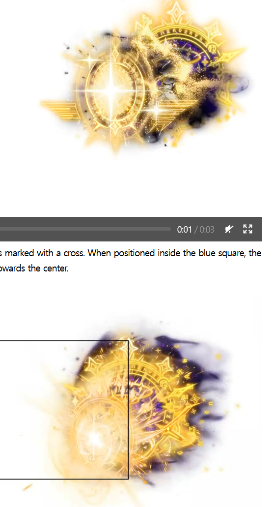

## Triangle Wave Patterns

I think the spot in the pic below is op, and you only have to worry about dodging triangles when it’s **left to right** and it’s the second wave (which starts at 80% health left). This won’t save you from other map patterns though.

Generally can treat them like will legs tho, as in dodge into one after it disappears

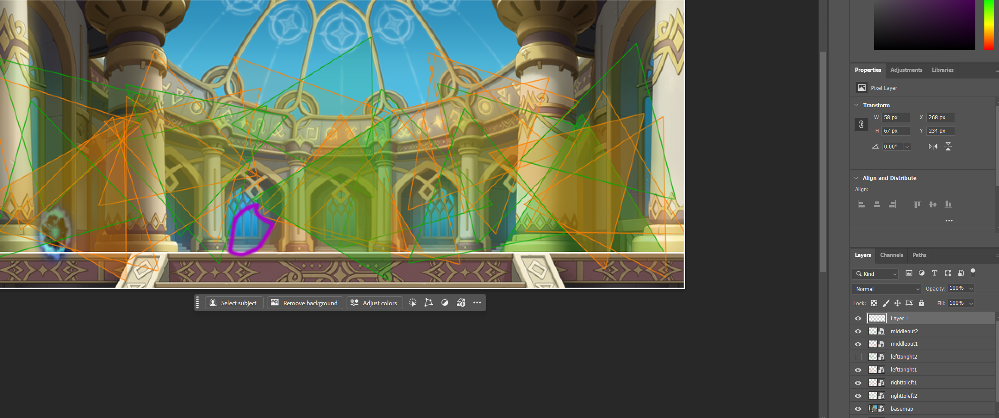

### All Wave 1

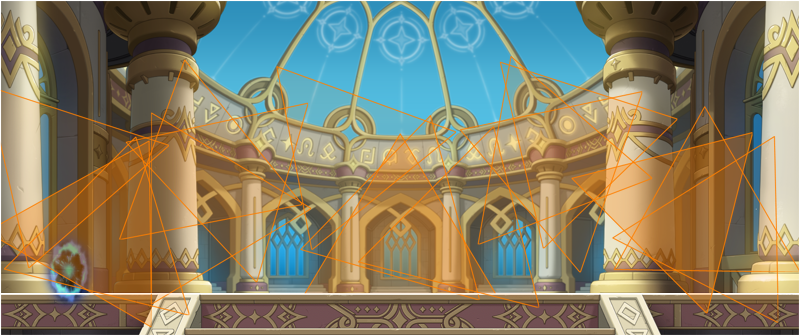

Safe spots below

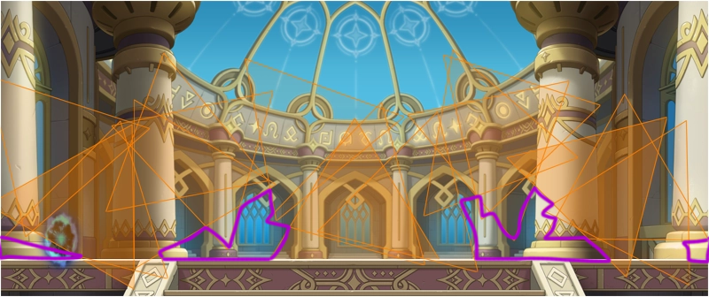

### All Wave 2

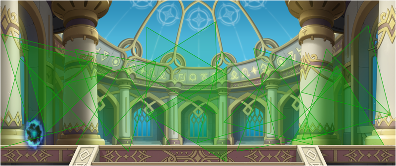

### Both waves overlayed

There are no safe spots lmao

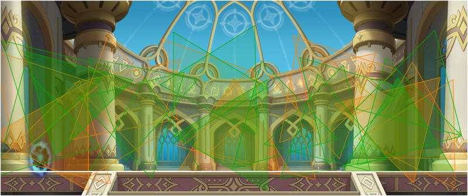

### Left to Right


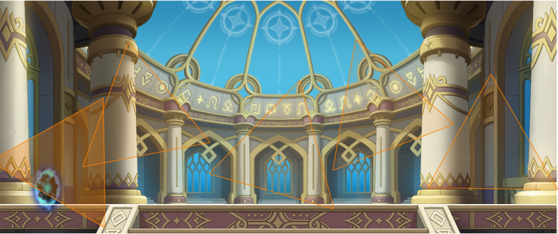

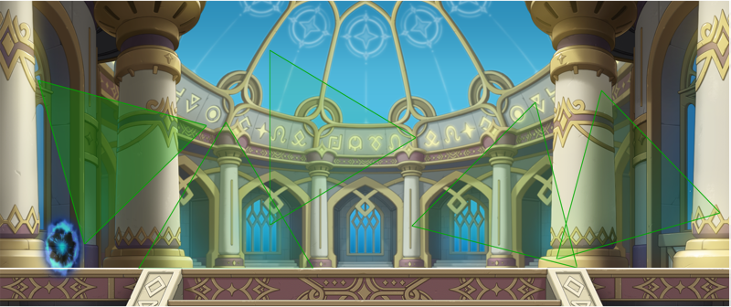

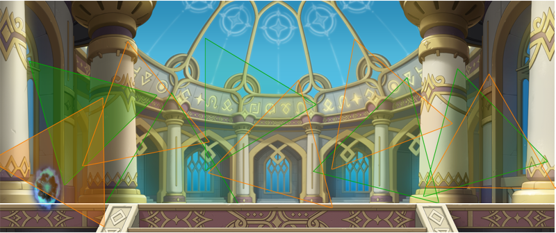

### Middle to Out


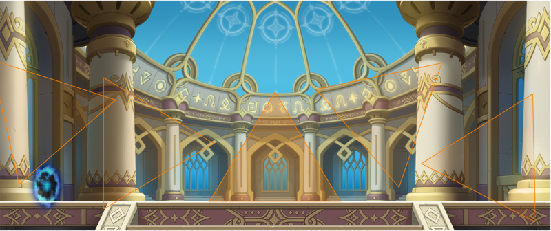

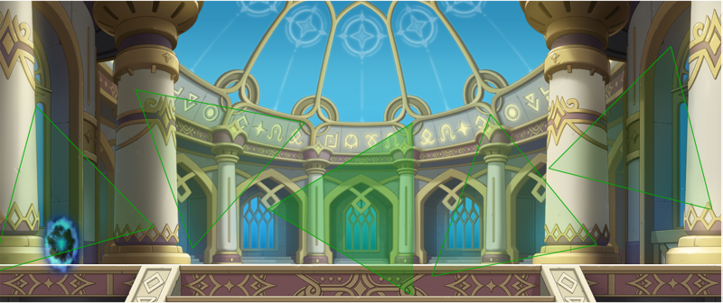

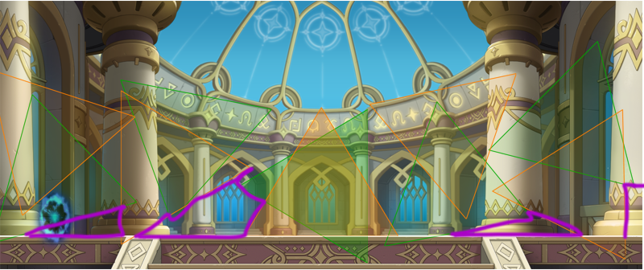

### Right to Left


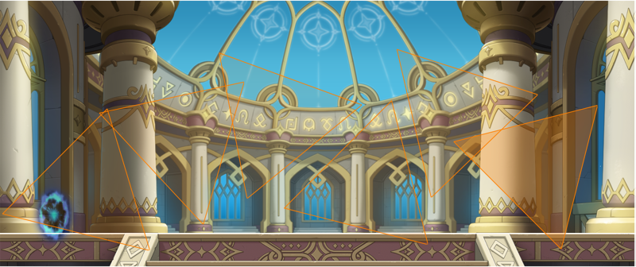

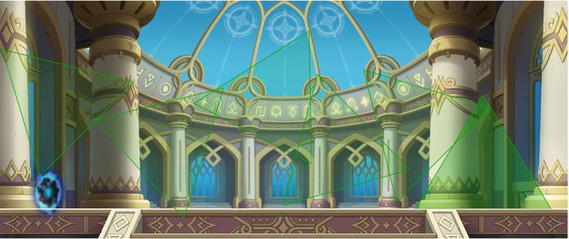

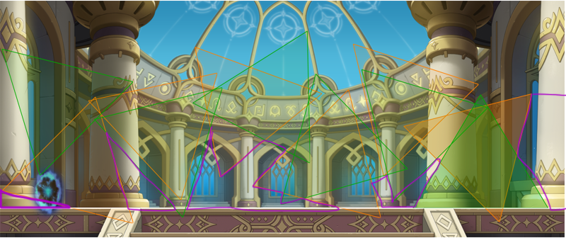